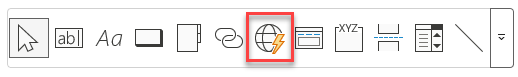
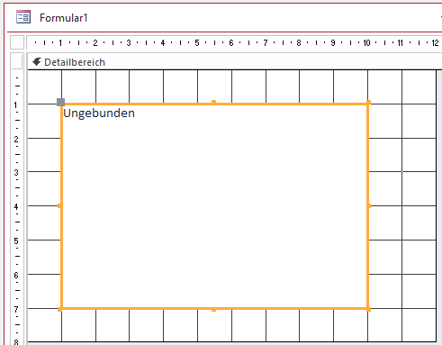
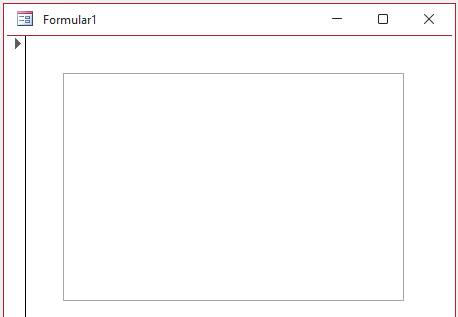
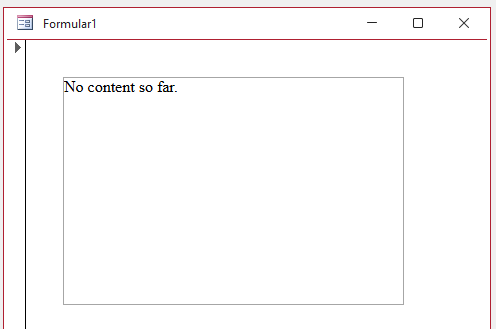

This doc explains how to insert an EdgeBrowser control to a form and how to set its properties so that a simple HTML file is displayed in it.

**Step 1:**  
Select the EdgeBrowser control from the control list.   


**Step 2:**  
Drag a rectangle onto the form. Cancel the upcomming dialog. The control will be inserted.  


No information is displayed in its current state.  


**Step 3:**  
Add a the following information to the control source property:  
```VBA
="https://msaccess/C:\Folder\Subfolder\files\Demo_01.html"
```  
As a result the file is displayed in the EdgeBrowser control:  

